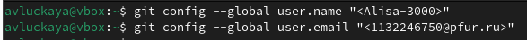
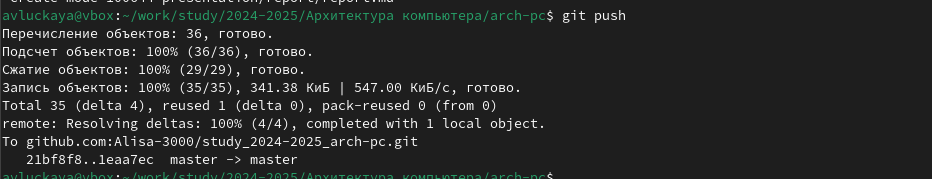

---
## Front matter
title: "Отчет по лабораторной работе №2"
subtitle: "Дисциплина: архитектура компьютера"
author: "Луцкая Алиса Витальевна"

## Generic otions
lang: ru-RU
toc-title: "Содержание"

## Bibliography
bibliography: bib/cite.bib
csl: pandoc/csl/gost-r-7-0-5-2008-numeric.csl

## Pdf output format
toc: true # Table of contents
toc-depth: 2
lof: true # List of figures
lot: true # List of tables
fontsize: 12pt
linestretch: 1.5
papersize: a4
documentclass: scrreprt
## I18n polyglossia
polyglossia-lang:
  name: russian
  options:
	- spelling=modern
	- babelshorthands=true
polyglossia-otherlangs:
  name: english
## I18n babel
babel-lang: russian
babel-otherlangs: english
## Fonts
mainfont: IBM Plex Serif
romanfont: IBM Plex Serif
sansfont: IBM Plex Sans
monofont: IBM Plex Mono
mathfont: STIX Two Math
mainfontoptions: Ligatures=Common,Ligatures=TeX,Scale=0.94
romanfontoptions: Ligatures=Common,Ligatures=TeX,Scale=0.94
sansfontoptions: Ligatures=Common,Ligatures=TeX,Scale=MatchLowercase,Scale=0.94
monofontoptions: Scale=MatchLowercase,Scale=0.94,FakeStretch=0.9
mathfontoptions:
## Biblatex
biblatex: true
biblio-style: "gost-numeric"
biblatexoptions:
  - parentracker=true
  - backend=biber
  - hyperref=auto
  - language=auto
  - autolang=other*
  - citestyle=gost-numeric
## Pandoc-crossref LaTeX customization
figureTitle: "Рис."
tableTitle: "Таблица"
listingTitle: "Листинг"
lofTitle: "Список иллюстраций"
lotTitle: "Список таблиц"
lolTitle: "Листинги"
## Misc options
indent: true
header-includes:
  - \usepackage{indentfirst}
  - \usepackage{float} # keep figures where there are in the text
  - \floatplacement{figure}{H} # keep figures where there are in the text
---

# Цель работы

Целью работы является изучить идеологию и применение средств контроля версий. Приобрести практические навыки по работе с системой git.

# Задание

4.1 Настройка github
4.2 Базовая настройка git
4.3 Создание ssh-ключа
4.4 Создание рабочего пространства и репозитория курса на основе шаблона
4.5 Создание репозитория курса на основе шаблона
4.6 Настройка каталога курса
5. Выполнение самостоятельной работы

# Теоретическое введение

Системы контроля версий (Version Control System, VCS) применяются при работе
нескольких человек над одним проектом. Обычно основное дерево проекта хранится в
локальном или удалённом репозитории, к которому настроен доступ для участников про-
екта. При внесении изменений в содержание проекта система контроля версий позволяет
их фиксировать, совмещать изменения, произведённые разными участниками проекта,
производить откат к любой более ранней версии проекта, если это требуется.
В классических системах контроля версий используется централизованная модель, пред-
полагающая наличие единого репозитория для хранения файлов. Выполнение большинства
функций по управлению версиями осуществляется специальным сервером. Участник про-
екта (пользователь) перед началом работы посредством определённых команд получает
нужную ему версию файлов. После внесения изменений, пользователь размещает новую
версию в хранилище. При этом предыдущие версии не удаляются из центрального хранили-
ща и к ним можно вернуться в любой момент. Сервер может сохранять не полную версию
изменённых файлов, а производить так называемую дельта-компрессию — сохранять только
изменения между последовательными версиями, что позволяет уменьшить объём хранимых
данных.
Системы контроля версий поддерживают возможность отслеживания и разрешения кон-
фликтов, которые могут возникнуть при работе нескольких человек над одним файлом.
Можно объединить (слить) изменения, сделанные разными участниками (автоматически
или вручную), вручную выбрать нужную версию, отменить изменения вовсе или заблоки-
ровать файлы для изменения. В зависимости от настроек блокировка не позволяет другим
пользователям получить рабочую копию или препятствует изменению рабочей копии файла
средствами файловой системы ОС, обеспечивая таким образом, привилегированный доступ
только одному пользователю, работающему с файлом.

# Выполнение лабораторной работы

##Настройка GitHub

Создаю учетную запись на сайте GitHub и заполняю основные данные для учетной записи (рис. [-@fig:001]).

{ #fig:001 width=70% }

Аккаунт создан (рис. [-@fig:002]).

{ #fig:002 width=70% }

## Базовая настройка Git

Произвожу базовую настройку  git,  для  это  открываю  терминал  и ввожу следующие команды: git config –global user.name “”, указывая свое имя и команду git config –global user.email “work@mail”, указывая в ней свою электронную почту (рис. [-@fig:003]).

{ #fig:003 width=70% }

Настраиваю utf-8 в выводе сообщений git(рис. [-@fig:004]).

{ #fig:004 width=70% }

Задаю имя  начальной ветки, называю «master» (рис. [-@fig:005]).

{ #fig:005 width=70% }

Задаю параметр autocrlf со значением input (рис. [-@fig:006])

{ #fig:006 width=70% }

Задаю параметр safecrlf со значением warn (рис. [-@fig:007]).

{ #fig:007 width=70% }

## Создание SSH-ключа

Для последующей идентификации пользователя на сервере репозиториев необ- ходимо сгенерировать пару ключей (приватный и открытый). Для этого ввожу команду ssh-keygen -C “Имя Фамилия, work@email”, указывая свое имя и электронную почту (рис. [-@fig:008])

{ #fig:008 width=70% }

Получаю сгенерированный открытый ключ, который буду вставлять на сайт http://github.org/ под своей учётной записью (рис. [-@fig:009])

{ #fig:009 width=70% }

Открываю браузер, захожу на сайт GitHub. Открываю свой профиль и перехожу в настройки (рис. [-@fig:010])

{ #fig:010 width=70% }

Выбираю страницу «SSH and GPG keys» (рис. [-@fig:011])

{ #fig:011 width=70% }

Нажимаю кнопку «New SSH key» (рис. [-@fig:012])

{ #fig:012 width=70% }

Вставляю скопированный ключ в поле «Key». В поле Title указываю имя для ключа. Нажимаю «Add SSH-key», чтобы завершить добавление ключа (рис. [-@fig:013])

{ #fig:013 width=70% }

Ключ создан (рис. [-@fig:014])

{ #fig:014 width=70% }

## Создание рабочего пространства и репозитория курсана основе шаблона

В терминале создаю директорию, с помощью утилиты mkdir, благодаря ключу -p создаю все директории после домашней ~/work/study/2024- 2025/“Архитектура компьютера” рекурсивно. Далее проверяю с помощью ls, проверяю их создание (рис. [-@fig:015])

{ #fig:015 width=70% }

## Создание репозитория курса на основе шаблона

В браузере перехожу на страницу репозитория с шаблоном курса по адресуhttps://github.com/yamadharma/course-directory-student-template. Выбираю «Use this template», чтобы использовать этот шаблон для репозитория (рис. [-@fig:016])

{ #fig:016 width=70% }

В открывшемся окне задаю имя и создаю репозиторий, нажимаю на кнопку «Create repository from template» (рис. [-@fig:017])

{ #fig:017 width=70% }

Репозиторий создан (рис. [-@fig:018])

{ #fig:018 width=70% }

Через терминал перехожу в созданный каталог курса с помощью утилиты cd (рис. [-@fig:019])

{ #fig:019 width=70% }

Копирую ссылку для клонирования  на странице  созданного репозитория, сна-чала перейдя в окно «code», далее выбрав в окне вкладку «SSH» (рис. [-@fig:020])

{ #fig:020 width=70% }

Клонирую созданный репозиторий с помощью команды git clone – recursivegit@github.com:/study_2024–2025_arh-pc.git arch-pc (рис. [-@fig:021])

{ #fig:021 width=70% }

## Настройка каталога курса

Перехожу в каталог arch-pc с помощью утилиты cd (рис. [-@fig:022])

{ #fig:022 width=70% }

Удаляю лишние файлы с помощью утилиты rm (рис. [-@fig:023])

{ #fig:023 width=70% }

Создаю необходимые каталоги и устанавливаю пакет make, тк до этого он был не установлен (рис. [-@fig:024])

{ #fig:024 width=70% }

Добавляем все изменения с помощью команды git add . Комментируем и сохраняемвсе изменения с сообщением о создании структуры курса (рис. [-@fig:025])

{ #fig:025 width=70% }

Отправляем все на сервер с помощью push (рис. [-@fig:026])

{ #fig:026 width=70% }

Проверяем на github (рис. [-@fig:027])

{ #fig:027 width=70% }

## Выполнение заданий для самостоятельной работы

Переходим в каталог с отчетами по лабораторной работе 2 (рис. [-@fig:028])

{ #fig:028 width=70% }

Создаем пустой файл с именем отчет.odt в текущем каталоге (рис. [-@fig:029])

{ #fig:029 width=70% }

Открываем файл в текстовом редакторе LibreOffice для редактирования (рис. [-@fig:030])

{ #fig:030 width=70% }

Комментируем изменения в репозитории с сообщением «Добавлен отчет по лабораторной работе №2» (рис. [-@fig:031])

{ #fig:031 width=70% }

Добавляем файл отчета (рис. [-@fig:032])

{ #fig:032 width=70% }

Отправляем все изменения в удаленный репозиторий на ветку master (рис. [-@fig:033])

{ #fig:033 width=70% }

С помощью команды cp копируем файл Л01_Луцкая_отчет.pdf из папки Загрузки в каталог
/work/study/2024-2025/Архитектура компьютера/arch-pc/labs/lab01/report/ , с помощью команды cd переходим в каталог с отчетами по лабораторной работе 1, с помощью -ls выводим список файлов в текущем каталоге (рис. [-@fig:034])

{ #fig:034 width=70% }

Добавляем файл Л01_Луцкая_отчет.pdf с помощью git add и добавляем комментарий с помощьюgit commit (рис. [-@fig:035])

{ #fig:035 width=70% }

Отправляем все изменения в репозиторий (рис. [-@fig:036])

{ #fig:036 width=70% }

Проверяем файлы в репозитории (рис. [-@fig:037])

{ #fig:037 width=70% }

# Выводы

В ходе выполнения лабораторной работы была изучена концепция и применение систем контроля версий, а также приобретены практические навыки работы с
системой git.

# Список литературы{.unnumbered}
1. [Архитектура ЭВМ](https://esystem.rudn.ru/pluginfile.php/1584622/mod_resource/content/1/%D0%9B%D0%B0%D0%B1%D0%BE%D1%80%D0%B0%D1%82%D0%BE%D1%80%D0%BD%D0%B0%D1%8F%20%D1%80%D0%B0%D0%B1%D0%BE%D1%82%D0%B0%20%E2%84%963.pdf)
2. [Git - gitattributes Документация](https://git-scm.com/docs/gitattributes)
