---
## Front matter
title: "Отчет по лабораторной работе №3"
subtitle: "Дисциплина: архитектура компьютера"
author: "Луцкая Алиса Витальевна"

## Generic otions
lang: ru-RU
toc-title: "Содержание"

## Bibliography
bibliography: bib/cite.bib
csl: pandoc/csl/gost-r-7-0-5-2008-numeric.csl

## Pdf output format
toc: true # Table of contents
toc-depth: 2
lof: true # List of figures
lot: true # List of tables
fontsize: 12pt
linestretch: 1.5
papersize: a4
documentclass: scrreprt
## I18n polyglossia
polyglossia-lang:
  name: russian
  options:
	- spelling=modern
	- babelshorthands=true
polyglossia-otherlangs:
  name: english
## I18n babel
babel-lang: russian
babel-otherlangs: english
## Fonts
mainfont: IBM Plex Serif
romanfont: IBM Plex Serif
sansfont: IBM Plex Sans
monofont: IBM Plex Mono
mathfont: STIX Two Math
mainfontoptions: Ligatures=Common,Ligatures=TeX,Scale=0.94
romanfontoptions: Ligatures=Common,Ligatures=TeX,Scale=0.94
sansfontoptions: Ligatures=Common,Ligatures=TeX,Scale=MatchLowercase,Scale=0.94
monofontoptions: Scale=MatchLowercase,Scale=0.94,FakeStretch=0.9
mathfontoptions:
## Biblatex
biblatex: true
biblio-style: "gost-numeric"
biblatexoptions:
  - parentracker=true
  - backend=biber
  - hyperref=auto
  - language=auto
  - autolang=other*
  - citestyle=gost-numeric
## Pandoc-crossref LaTeX customization
figureTitle: "Рис."
tableTitle: "Таблица"
listingTitle: "Листинг"
lofTitle: "Список иллюстраций"
lotTitle: "Список таблиц"
lolTitle: "Листинги"
## Misc options
indent: true
header-includes:
  - \usepackage{indentfirst}
  - \usepackage{float} # keep figures where there are in the text
  - \floatplacement{figure}{H} # keep figures where there are in the text
---

# Цель работы

Целью данной лабораторной работы является освоение процедуры оформления отчетов с помощью легковесного языка разметки Markdown.

# Задание

1. Установка необходимого ПО
2. Заполнение отчета по выполнению лабораторной работы №3 с помощью языка разметки Markdown
3. Задание для самостоятельной работы

# Теоретическое введение

Markdown - легковесный язык разметки, созданный с целью обозначения форматирования в простом тексте, с максимальным сохранением его читаемости человеком, и пригодный для машинного преобразования в языки для продвинутых публикаций. 
Внутритекстовые формулы делаются аналогично формулам LaTeX.
В Markdown вставить изображение в документ можно с помощью непосредственного указания адреса изображения.
Синтаксис Markdown для встроенной ссылки состоит из части [link text], представляющей текст гиперссылки, и части (file-name.md) – URL-адреса или имени файла, на который дается ссылка.
Markdown поддерживает как встраивание фрагментов кода в предложение, так и их размещение между предложениями в виде отдельных огражденных блоков. Огражденные блоки кода — это простой способ выделить синтаксис для фрагментов кода.

# Выполнение лабораторной работы

## Установление необходимого ПО

### Установка TexLive

Скачала TexLive с официального сайта. Распаковываю архив (рис. [-@fig:001])

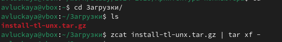{ #fig:001 width=70% }

Перехожу в распакованную папку с помощью cd. Запускаю скрипт install-tl-* с правами root, используя sudo в начале команды (рис. [-@fig:002])

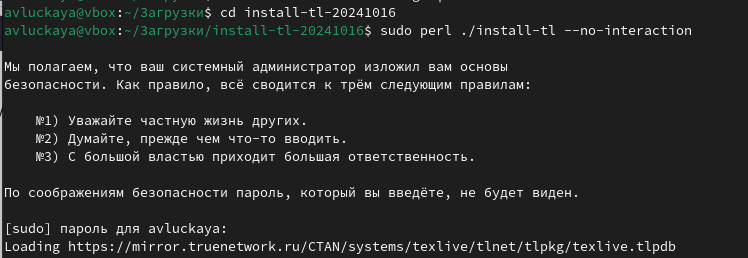{ #fig:002 width=70% }

### Установка pandoc и pandoc-crossref

Перехожу в папку Загрузки, скачиваю архив pandoc версии 2.18. (рис. [-@fig:003]).

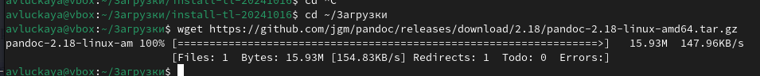{ #fig:003 width=70% }

Скачиваю архив pandoc-crossref 0.3.13.0 (рис. [-@fig:004]).

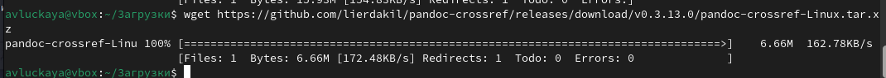{ #fig:004 width=70% }

Распаковываю скачанные архивы (рис. [-@fig:005]).

{ #fig:005 width=70% }

Копирую файлы pandoc и pandoc-crossref в каталог /usr/local/bin/ с правами пользователя root с помощью sudo (рис. [-@fig:006]).

{ #fig:006 width=70% }

Проверяю корректность выполненных действий (рис. [-@fig:007]).

{ #fig:007 width=70% }

## Заполнение отчета по выполнению лабораторной работы №4 с помощью языка разметки Markdown

Открываю терминал. Перехожу в каталог курса, обновляю локальный репозиторий, скачав изменения из удаленного репозитория с помощью команды git pull (рис. [-@fig:008]).

{ #fig:008 width=70% }

Перехожу в каталог с шаблоном отчета по лабораторной работе №3 с помощью cd, компилирую шаблон с использованием Makefile, вводя команду make (рис. [-@fig:009]).

{ #fig:009 width=70% }

Открываю сгенерированный файл report.docx LibreOffice (рис. [-@fig:010]).

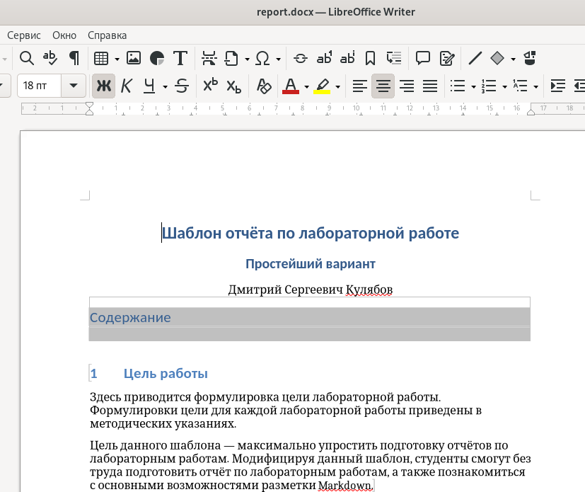{ #fig:010 width=70% }

Открываю сгенерированный файл report.pdf (рис. [-@fig:011]). Убедилась, что все правильно сгенерировалось.

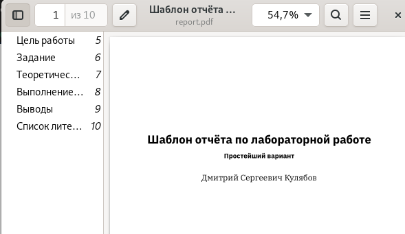{ #fig:011 width=70% }

Удаляю полученные файлы с использованием Makefile, вводя команду make clean (рис. [-@fig:012]). С помощью команды ls проверяю, удалились ли созданные файлы.

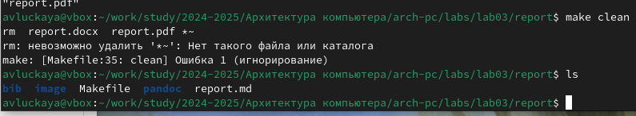{ #fig:012 width=70% }

Открываю файл report.md и внимательно его изучаю (рис. [-@fig:013])

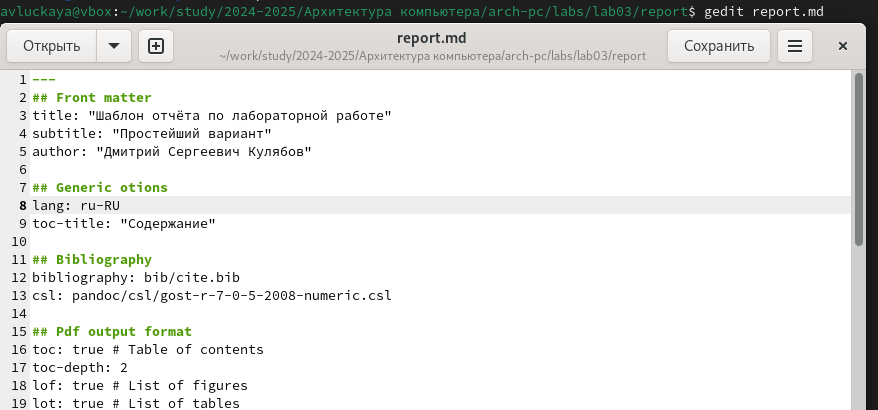{ #fig:013 width=70% }

Копируй файл report.md и называю его Л03_Луцкая_отчет.md (рис. [-@fig:015])

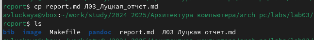{ #fig:015 width=70% }

Открываю файл в gedit и заполняю отчет по 3 лабораторной работе (рис. [-@fig:016])

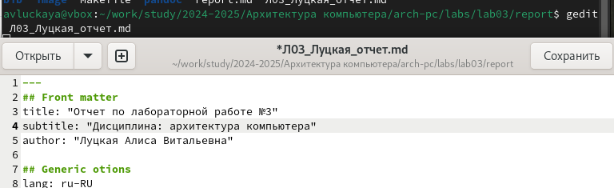{ #fig:016 width=70% }

Компилирую файл с отчетом. Загружаю отчет на GitHub.

## Задание для самостоятельной работы

 Перехожу в директорию lab03/report с помощью cd, чтобы там заполнять отчет по третьей лабораторной работе (рис. [-@fig:017]).
 
 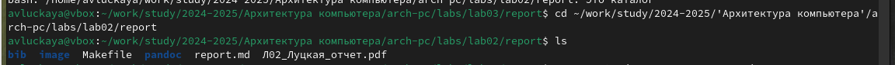{ #fig:017 width=70% }
 
 Копирую файл report.md и называю Л03_Луцкая_отчет.md и проверяю коректность (рис. [-@fig:018])
 
 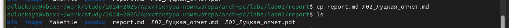{ #fig:018 width=70% }
 
 Открываю файл с помощью текстового редактора  и начинаю заполнять отчет (рис. [-@fig:019])
 
 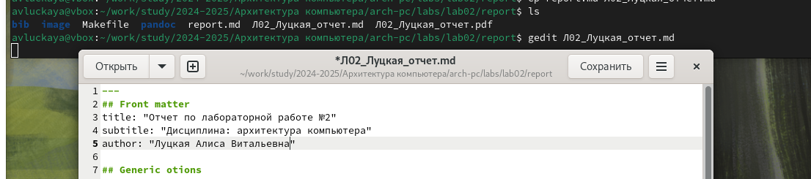{ #fig:019 width=70% }
 
 Удаляю старый файл для коректной компиляции, проверяю, что все удалилось  (рис. [-@fig:020])
 
 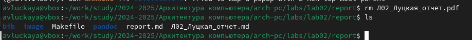{ #fig:020 width=70% }
 
 С помощью make компилирую файл в форматы pdf и docx, удаляю лишние сгенерированные файлы report.docx и report.pdf,проверяю коректность выполнения команд (рис. [-@fig:021])
 
 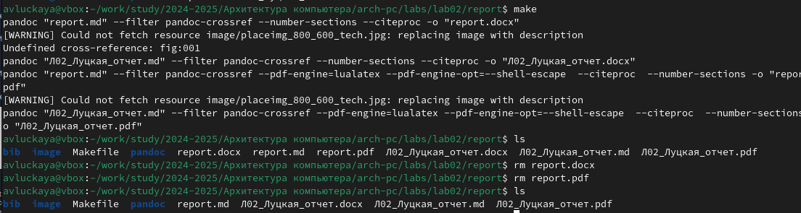{ #fig:021 width=70% }
 
 Добавляю изменения на GitHub с помощью комнадой git add и сохраняю изменения с помощью commit ([-@fig:022]).

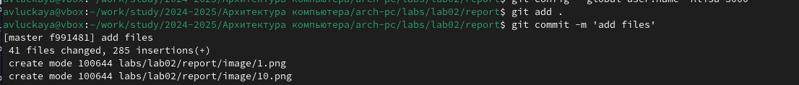{ #fig:022 width=70% }

Отправлялю файлы на сервер с помощью команды git push ([-@fig:023]).

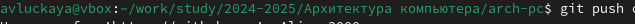{ #fig:023 width=70% }

# Выводы

В результате выполнения данной лабораторной работы я освоила процедуры оформления отчетов с помощью легковесного языка разметки Markdown.

# Список литературы{.unnumbered}

1. [Архитектура ЭВМ](https://esystem.rudn.ru/pluginfile.php/1584625/mod_resource/content/1/%D0%9B%D0%B0%D0%B1%D0%BE%D1%80%D0%B0%D1%82%D0%BE%D1%80%D0%BD%D0%B0%D1%8F%20%D1%80%D0%B0%D0%B1%D0%BE%D1%82%D0%B0%20%E2%84%964.pdf)
