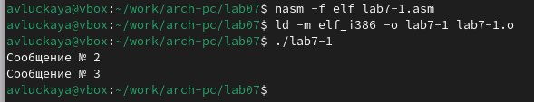

---
## Front matter
title: "Отчет по лабораторной работе №7"
subtitle: "Дисциплина: архитектура компьютера"
author: "Луцкая Алиса Витальевна"

## Generic otions
lang: ru-RU
toc-title: "Содержание"

## Bibliography
bibliography: bib/cite.bib
csl: pandoc/csl/gost-r-7-0-5-2008-numeric.csl

## Pdf output format
toc: true # Table of contents
toc-depth: 2
lof: true # List of figures
lot: true # List of tables
fontsize: 12pt
linestretch: 1.5
papersize: a4
documentclass: scrreprt
## I18n polyglossia
polyglossia-lang:
  name: russian
  options:
	- spelling=modern
	- babelshorthands=true
polyglossia-otherlangs:
  name: english
## I18n babel
babel-lang: russian
babel-otherlangs: english
## Fonts
mainfont: IBM Plex Serif
romanfont: IBM Plex Serif
sansfont: IBM Plex Sans
monofont: IBM Plex Mono
mathfont: STIX Two Math
mainfontoptions: Ligatures=Common,Ligatures=TeX,Scale=0.94
romanfontoptions: Ligatures=Common,Ligatures=TeX,Scale=0.94
sansfontoptions: Ligatures=Common,Ligatures=TeX,Scale=MatchLowercase,Scale=0.94
monofontoptions: Scale=MatchLowercase,Scale=0.94,FakeStretch=0.9
mathfontoptions:
## Biblatex
biblatex: true
biblio-style: "gost-numeric"
biblatexoptions:
  - parentracker=true
  - backend=biber
  - hyperref=auto
  - language=auto
  - autolang=other*
  - citestyle=gost-numeric
## Pandoc-crossref LaTeX customization
figureTitle: "Рис."
tableTitle: "Таблица"
listingTitle: "Листинг"
lofTitle: "Список иллюстраций"
lotTitle: "Список таблиц"
lolTitle: "Листинги"
## Misc options
indent: true
header-includes:
  - \usepackage{indentfirst}
  - \usepackage{float} # keep figures where there are in the text
  - \floatplacement{figure}{H} # keep figures where there are in the text
---

# Цель работы

Изучение команд условного и безусловного переходов. Приобретение навыков написания
программ с использованием переходов. Знакомство с назначением и структурой файла
листинга.

# Задание

1. Реализация переходов в NASM
2. Изучение структуры файлов листинга
3. Задания для самостоятельной работы

# Теоретическое введение

Для реализации ветвлений в ассемблере используются так называемые команды передачи
управления или команды перехода. Можно выделить 2 типа переходов:
• условный переход – выполнение или не выполнение перехода в определенную точку
программы в зависимости от проверки условия.
• безусловный переход – выполнение передачи управления в определенную точку про-
граммы без каких-либо условий.

# Выполнение лабораторной работы

## Реализация переходов в NASM

Создаю каталог для программ лабораторной работы №7, а также перехожу в него и со-
здаю файл lab7-1.asm: (рис. -@fig:001).

{#fig:001 width=70%}

Ввожу в файл lab7-1.asm текст программы из листинга 7.1. (рис. -@fig:002).

{#fig:002 width=70%}

Создаю исполняемый файл и запускаю его. Убеждаюсь,что инструкции jmp _label2 меняет порядок исполнения инструкций и позволяет выполнить инструкции начиная с метки _label2, пропустив вывод первого сообщения. (рис. -@fig:003).

{#fig:003 width=70%}

Изменяю текст программы в соответствии с листингом 7.2., чтобы поменялся порядок выполнения функций (рис. -@fig:004).

{#fig:004 width=70%}

Запускаю программу и проверяю, что примененные изменения верны (рис. -@fig:005).

{#fig:005 width=70%}

Изменяю текст программы так, чтобы все три сообщения вывелись в обратном порядке (рис. -@fig:006).

{#fig:006 width=70%}

Проверяю коректность выполнения программы (рис. -@fig:007). Все работает верно.

{#fig:007 width=70%}

Создаю файл lab7-2.asm в каталоге ~/work/arch-pc/lab07. Внимательно изучаю текст
программы из листинга 7.3(рис. -@fig:008).

{#fig:008 width=70%}

Ввожу текст программы из листинга 7.3 в lab7-2.asm.(рис. -@fig:009).

{#fig:009 width=70%}

Программа выводит значение переменной с максимальным значением, проверяю работу программы с разными входными данными (рис. -@fig:010).

{#fig:010 width=70%}

## Изучение структуры файла листинга

Создаю файл листинга с помощью флага -l команды nasm и открываю его с помощью текстового редактора gedit (рис. -@fig:011).

{#fig:011 width=70%}

127 0000009C 53 <1> push ebx: Эта строка сохраняет содержимое регистра ebx на вершину стека. push — это инструкция, которая уменьшает указатель стека на 4 байта (размер регистра) и записывает значение регистра ebx в освободившееся место в памяти
128 0000009D 51 <1> push ecx: Аналогично, эта строка сохраняет содержимое регистра ecx на вершину стека. Значение ecx записывается на вершину стека поверх значения ebx.
136 000000AC 31DB <1> xor ebx, ebx: Эта команда устанавливает регистр ebx в ноль. xor — это побитовая операция XOR (исключающее ИЛИ). При применении xor к регистру самому себе он обнуляется. 

Удаляю один операнд из случайной инструкции(рис. -@fig:012).

{#fig:012 width=70%}

В новом файле листинга показывает ошибку, которая возникла при попытке трансляции файла. Никакие выходные файлы при этом помимо файла листинга не создаются. (рис. -@fig:013).

{#fig:013 width=70%}

## Задания для самостоятельной работы

Выбираю вариант полученный в ходе выполнения лабороторной работы №6, мой вариант- 11. 

С помощью команды touch создаю новый файл lab7-3.asm. Пишу программу для нахождения наименьшего числа из трех (рис. -@fig:014).

{#fig:014 width=70%}

Проверяю корректность написания первой программы. Программа работает верно (рис. -@fig:015).

{#fig:015 width=70%}

Код первой программы: 

```NASM
%include 'in_out.asm'

section .data
msg1 db 'Введите B: ',0h
msg2 db "Наименьшее число: ",0h
A dd '21'
C dd '34'

section .bss
min resb 10
B resb 10

section .text
global _start
_start:

mov eax,msg1
call sprint

mov ecx,B
mov edx,10
call sread

mov eax,B
call atoi 
mov [B],eax 

mov ecx,[A] 
mov [min],ecx 

cmp ecx,[C] 
jl check_B 
mov ecx,[C] 
mov [min],ecx 

check_B:
mov eax, min
call atoi 
mov [min],eax 

mov ecx,[min]
cmp ecx,[B] 
jl fin 
mov ecx,[B] 
mov [min],ecx

fin:
mov eax, msg2
call sprint 
mov eax,[min]
call iprintLF 
call quit 
```

Пишу программу, которая будет вычислять значение заданной функции согласно моему варианту для введенных с клавиатурых переменных a и x (рис. -@fig:016).

{#fig:016 width=70%}

Проверяю корректность написания первой программы. Программа работает верно (рис. -@fig:017).

{#fig:017 width=70%}

Код второй программы: 

```NASM
%include 'in_out.asm'
section .data
msg1 db 'Введите x: ',0h
msg2 db 'Введите a: ',0h

section .bss
x resd 1 
a resd 1 
result resd 1 

section .text
global _start
_start:

mov eax,msg1
call sprint

mov ecx,x
mov edx,10
call sread

mov eax,x
call atoi 
mov [x],eax 

mov eax,msg2
call sprint

mov ecx,a
mov edx,10
call sread

mov eax,a
call atoi 
mov [a],eax 

mov eax, [a]   ; Загрузить a в eax
mov ebx, 4     ; Загрузить 4 в ebx
mul ebx        ; eax = eax * ebx (4*a)
add eax, [x]   ; eax = eax + x (4*a + x)
mov [result], eax 

fin:
mov eax,[result]
call iprintLF 
call quit 

```

# Выводы

При выполнении лабораторной работы я изучил команды условных и безусловных переходво, а также приобрел навыки написания программ с использованием перходов, познакомился
с назначением и структурой файлов листинга.

# Список литературы

1. https://esystem.rudn.ru/course/view.php?id=112


