---
## Front matter
title: "Отчет по лабораторной работе №8"
subtitle: "Дисциплина: архитектура компьютера"
author: "Луцкая Алиса Витальевна"

## Generic otions
lang: ru-RU
toc-title: "Содержание"

## Bibliography
bibliography: bib/cite.bib
csl: pandoc/csl/gost-r-7-0-5-2008-numeric.csl

## Pdf output format
toc: true # Table of contents
toc-depth: 2
lof: true # List of figures
lot: true # List of tables
fontsize: 12pt
linestretch: 1.5
papersize: a4
documentclass: scrreprt
## I18n polyglossia
polyglossia-lang:
  name: russian
  options:
	- spelling=modern
	- babelshorthands=true
polyglossia-otherlangs:
  name: english
## I18n babel
babel-lang: russian
babel-otherlangs: english
## Fonts
mainfont: IBM Plex Serif
romanfont: IBM Plex Serif
sansfont: IBM Plex Sans
monofont: IBM Plex Mono
mathfont: STIX Two Math
mainfontoptions: Ligatures=Common,Ligatures=TeX,Scale=0.94
romanfontoptions: Ligatures=Common,Ligatures=TeX,Scale=0.94
sansfontoptions: Ligatures=Common,Ligatures=TeX,Scale=MatchLowercase,Scale=0.94
monofontoptions: Scale=MatchLowercase,Scale=0.94,FakeStretch=0.9
mathfontoptions:
## Biblatex
biblatex: true
biblio-style: "gost-numeric"
biblatexoptions:
  - parentracker=true
  - backend=biber
  - hyperref=auto
  - language=auto
  - autolang=other*
  - citestyle=gost-numeric
## Pandoc-crossref LaTeX customization
figureTitle: "Рис."
tableTitle: "Таблица"
listingTitle: "Листинг"
lofTitle: "Список иллюстраций"
lotTitle: "Список таблиц"
lolTitle: "Листинги"
## Misc options
indent: true
header-includes:
  - \usepackage{indentfirst}
  - \usepackage{float} # keep figures where there are in the text
  - \floatplacement{figure}{H} # keep figures where there are in the text
---

# Цель работы

Приобретение навыков написания программ с использованием циклов и обработкой
аргументов командной строки.

# Задание

1. Реализация циклом в NASM
2. Обработка аргументов командной строки
3. Задания для самостоятельной работы

# Теоретическое введение

Стек — это структура данных, организованная по принципу LIFO («Last In — First Out»
или «последним пришёл — первым ушёл»). Стек является частью архитектуры процессора и
реализован на аппаратном уровне. Для работы со стеком в процессоре есть специальные
регистры (ss, bp, sp) и команды.
Основной функцией стека является функция сохранения адресов возврата и передачи
аргументов при вызове процедур. Кроме того, в нём выделяется память для локальных
переменных и могут временно храниться значения регистров.

# Выполнение лабораторной работы

## Реализация циклов в NASM

Создаю каталог для программам лабораторной работы № 8, перехожу в него и создаю файл lab8-1.asm (рис. -@fig:001).

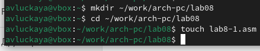{#fig:001 width=70%}

Ввожу в созданный файл программу из листинга. (рис. -@fig:002).

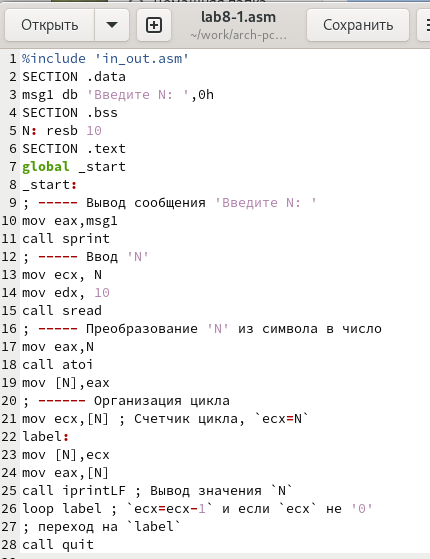{#fig:002 width=70%}

Создаю исполняемый файл и проверяю его работу (рис. -@fig:003).

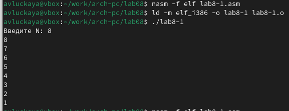{#fig:003 width=70%}

Заменяю программу изначальную так, что в теле цикла я изменяю значение регистра ecx (рис. -@fig:004).

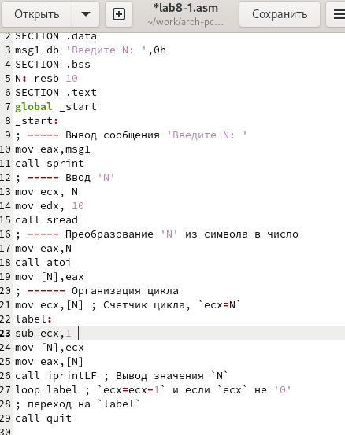{#fig:004 width=70%}

Из-за того, что теперь регистр ecx на каждой итерации уменьшается на 2 значения, количество итераций уменьшается вдвое (рис. -@fig:005).

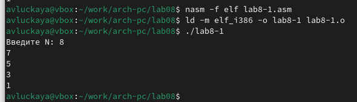{#fig:005 width=70%}

Вношу изменения в текст программы добавив команды push
и pop для сохранения значения счетчика цикла loop (рис. -@fig:006).

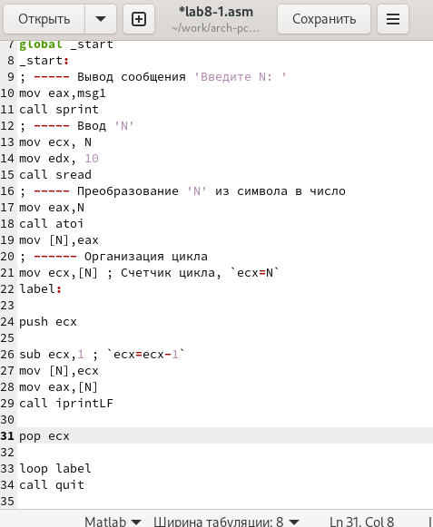{#fig:006 width=70%}

Количество итераций совпадает с введенным N, но произошло смещение выводимых чисел на -1 (рис. -@fig:007).

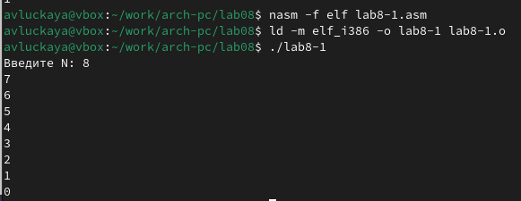{#fig:007 width=70%}

## Обработка аргументов командной строки

Создаю файл lab8-2.asm в каталоге ~/work/arch-pc/lab08 и ввожу в него текст программы из листинга 8.2 (рис. -@fig:008).

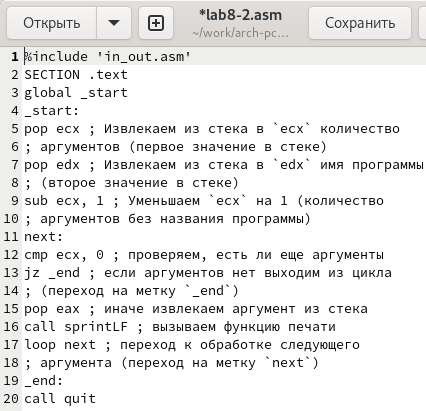{#fig:008 width=70%}

Создаю исполняемый файл и запускаю его, указав аргументы: аргумент1 аргумент 2 'аргумент 3' (рис. -@fig:009).

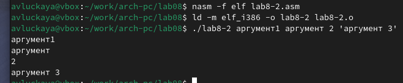{#fig:009 width=70%}

Создаю файл lab8-3.asm в каталоге ~/work/arch-pc/lab08 и ввожу в него текст программы из листинга 8.3. (рис. -@fig:010).

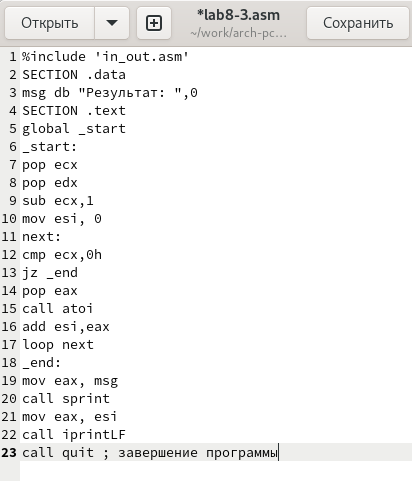{#fig:010 width=70%}

Создаю исполняемый файл и запускаю его, указав аргументы 12 13 7 10 5.(рис. -@fig:011).

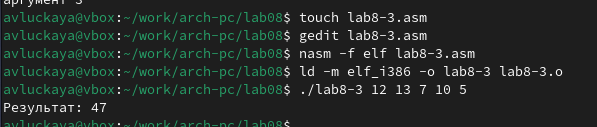{#fig:011 width=70%}

Изменяю программу так, чтобы указанные аргументы она умножала, а не складывала (рис. -@fig:012).

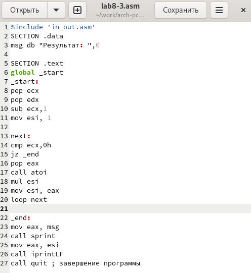{#fig:012 width=70%}

Создаю исполняемый файл и запускаю его. (рис. -@fig:013). Программа действительно перемножает вводимые аргументы.

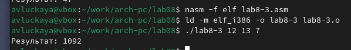{#fig:013 width=70%}

## Задание для самостоятельной работы

Пишу программму, которая будет находить сумма значений для функции f(x) = 15x+2,
которая совпадает с моим 11 варинтом (рис. -@fig:014).

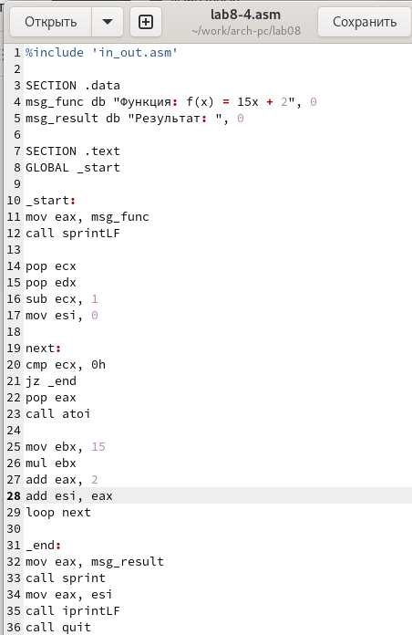{#fig:014 width=70%}

Создаю исполняемый файл и запускаю его. Проверяю работу программы с разными аргументами (рис. -@fig:015). Программа работает корректно.

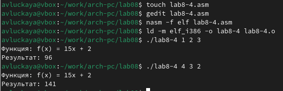{#fig:015 width=70%}

Код программы:
```NASM
%include 'in_out.asm'

SECTION .data
msg_func db "Функция: f(x) = 15x + 2", 0  
msg_result db "Результат: ", 0

SECTION .text
GLOBAL _start

_start:
mov eax, msg_func
call sprintLF

pop ecx          
pop edx          
sub ecx, 1      
mov esi, 0      

next:
cmp ecx, 0h
jz _end
pop eax          
call atoi

mov ebx, 15      
mul ebx          
add eax, 2       
add esi, eax     
loop next

_end:
mov eax, msg_result
call sprint
mov eax, esi
call iprintLF
call quit
```

# Выводы

В результате выполнения данной лабораторной работы я приобрел навыки написания программ с использованием циклов а также научился обрабатывать аргументы командной строки.

# Список литературы{.unnumbered}
1. https://esystem.rudn.ru/course/view.php?id=112
