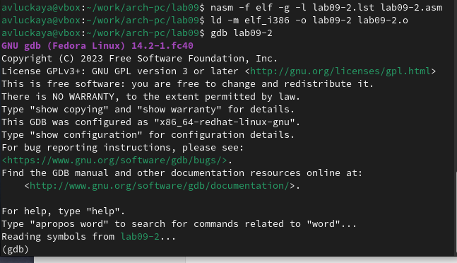

---
## Front matter
title: "Отчет по лабораторной работе №9"
subtitle: "Дисциплина: архитектура компьютера"
author: "Луцкая Алиса Витальевна"

## Generic otions
lang: ru-RU
toc-title: "Содержание"

## Bibliography
bibliography: bib/cite.bib
csl: pandoc/csl/gost-r-7-0-5-2008-numeric.csl

## Pdf output format
toc: true # Table of contents
toc-depth: 2
lof: true # List of figures
lot: true # List of tables
fontsize: 12pt
linestretch: 1.5
papersize: a4
documentclass: scrreprt
## I18n polyglossia
polyglossia-lang:
  name: russian
  options:
	- spelling=modern
	- babelshorthands=true
polyglossia-otherlangs:
  name: english
## I18n babel
babel-lang: russian
babel-otherlangs: english
## Fonts
mainfont: IBM Plex Serif
romanfont: IBM Plex Serif
sansfont: IBM Plex Sans
monofont: IBM Plex Mono
mathfont: STIX Two Math
mainfontoptions: Ligatures=Common,Ligatures=TeX,Scale=0.94
romanfontoptions: Ligatures=Common,Ligatures=TeX,Scale=0.94
sansfontoptions: Ligatures=Common,Ligatures=TeX,Scale=MatchLowercase,Scale=0.94
monofontoptions: Scale=MatchLowercase,Scale=0.94,FakeStretch=0.9
mathfontoptions:
## Biblatex
biblatex: true
biblio-style: "gost-numeric"
biblatexoptions:
  - parentracker=true
  - backend=biber
  - hyperref=auto
  - language=auto
  - autolang=other*
  - citestyle=gost-numeric
## Pandoc-crossref LaTeX customization
figureTitle: "Рис."
tableTitle: "Таблица"
listingTitle: "Листинг"
lofTitle: "Список иллюстраций"
lotTitle: "Список таблиц"
lolTitle: "Листинги"
## Misc options
indent: true
header-includes:
  - \usepackage{indentfirst}
  - \usepackage{float} # keep figures where there are in the text
  - \floatplacement{figure}{H} # keep figures where there are in the text
---

# Цель работы

Приобретение навыков написания программ с использованием подпрограмм. Знакомство
с методами отладки при помощи GDB и его основными возможностями.

# Задание

1. Реализация подпрограмм в NASM
2. Отладка программ с помощью GDB
3. Задания для самостоятельной работы

# Теоретическое введение

Отладка — это процесс поиска и исправления ошибок в программе. В общем случае его
можно разделить на четыре этапа:

• обнаружение ошибки;
• поиск её местонахождения;
• определение причины ошибки;
• исправление ошибки.

Можно выделить следующие типы ошибок:

• синтаксические ошибки — обнаруживаются во время трансляции исходного кода и
вызваны нарушением ожидаемой формы или структуры языка;
• семантические ошибки — являются логическими и приводят к тому, что программа
запускается, отрабатывает, но не даёт желаемого результата;
• ошибки в процессе выполнения — не обнаруживаются при трансляции и вызывают пре-
рывание выполнения программы (например, это ошибки, связанные с переполнением
или делением на ноль).

Второй этап — поиск местонахождения ошибки. Некоторые ошибки обнаружить доволь-
но трудно. Лучший способ найти место в программе, где находится ошибка, это разбить
программу на части и произвести их отладку отдельно друг от друга.

Третий этап — выяснение причины ошибки. После определения местонахождения ошибки
обычно проще определить причину неправильной работы программы.
Последний этап — исправление ошибки. После этого при повторном запуске программы,
может обнаружиться следующая ошибка, и процесс отладки начнётся заново.

# Выполнение лабораторной работы

## Релазиация подпрограмм в NASM

Создаю каталог для выполнения лабораторной работы № 9, перехожу в него и со-
здаю файл lab09-1.asm (рис. -@fig:001).

{#fig:001 width=70%}

Ввод в файл кода из листинга (рис. -@fig:002).

{#fig:002 width=70%}

Компилирую и запускаю его, данная программа выполняет вычисление функции(рис. -@fig:003).

{#fig:003 width=70%}

Изменяю текст программы, добавив в нее подпрограмму, теперь она вычисляет значение функции для выражения f(g(x)) (рис. -@fig:004).

{#fig:004 width=70%}

Компилирую и запускаю его (рис. -@fig:005).

{#fig:005 width=70%}

### Отладка программ с помощью GDB

Создайте файл lab09-2.asm с текстом программы из Листинга 9.2.(рис. -@fig:006).

{#fig:006 width=70%}

Загружаю исполняемый файл в отладчик gdb (рис. -@fig:007).

{#fig:007 width=70%}

Проверьте работу программы, запустив ее в оболочке GDB с помощью команды run (рис. -@fig:008).

{#fig:008 width=70%}

Для более подробного анализа программы установливаю брейкпоинт на метку _start и запускаю её. (рис. -@fig:009).

{#fig:009 width=70%}

Просматриваю дисассимилированный код программы с помощью команды disassemble (рис. -@fig:010).

{#fig:010 width=70%}

Переключаюсь на отображение команд с Intel’овским синтаксисом, введя команду set
disassembly-flavor intel (рис. -@fig:011).

{#fig:011 width=70%}

Далее смотрю дисассимилированный код программы, перевожу на команд с синтаксисом Intel (рис. -@fig:012).

Различия между синтаксисом ATT и Intel заключаются в порядке операндов (ATT - Операнд источника указан первым. Intel - Операнд назначения указан первым), их размере (ATT - pазмер операндов указывается явно с помощью суффиксов, непосредственные операнды предваряются символом $; Intel - Размер операндов неявно определяется контекстом, как ax, eax, непосредственные операнды пишутся напрямую), именах регистров(ATT - имена регистров предваряются символом %, Intel - имена регистров пишутся без префиксов).

{#fig:012 width=70%}

Включаю режим псевдографики для более удобного анализа программы (рис. -@fig:013).

{#fig:013 width=70%}

### Добавление точек останова

Проверяю в режиме псевдографики, что брейкпоинт сохранился. Устаналиваю еще одну точку останова по адресу инструкции (рис. -@fig:014).

{#fig:014 width=70%}

### Работа с данными программы в GDB

Просматриваю содержимое регистров командой info registers (рис. -@fig:015).

{#fig:015 width=70%}

Смотрю содержимое переменных по имени и по адресу (рис. -@fig:017).

{#fig:017 width=70%}

Меняю содержимое переменных по имени и по адресу (рис. -@fig:018).

{#fig:018 width=70%}

Вывожу в различных форматах значение регистра edx (рис. -@fig:019).

{#fig:019 width=70%}

С помощью команды set меняю содержимое регистра ebx (рис. -@fig:020).

{#fig:020 width=70%}

### Обработка аргументов командной строки в GDB

Копирую файл lab8-2.asm, созданный при выполнении лабораторной работы №8,
с программой выводящей на экран аргументы командной строки (Листинг 8.2) в файл с
именем lab09-3.asm. Создаю исполняемый файл. Загружаю исполняемый файл в отладчик, указав аргументы. (рис. -@fig:021).

{#fig:021 width=70%}

Запускаю программу с режиме отладки с указанием аргументов, указываю брейкпопнт и запускаю отладку. Проверяю работу стека, 
изменяя аргумент команды просмотра регистра esp на +4, число обусловлено разрядностью системы, а указатель void занимает как раз 4 байта,
ошибка при аргументе +24 означает, что аргументы на вход программы закончились. (рис. -@fig:017).

{#fig:022 width=70%}

## Задание для самостоятельной работы 

1. Меняю программу самостоятельной части предыдущей лабораторной работы с использованием подпрограммы (рис. -@fig:023).

{#fig:023 width=70%}

2. Запускаю программу в режике отладичка и пошагово через si просматриваю изменение значений регистров через i r.
При выполнении инструкции mul ecx можно заметить, что результат умножения записывается в регистр eax, но также меняет и edx. 
Значение регистра ebx не обновляется напрямую, поэтому результат программа неверно подсчитывает функцию (рис. -@fig:024).

{#fig:024 width=70%}

Исправляю найденную ошибку (рис. -@fig:025).

{#fig:025 width=70%}

Проверка выполнения программы (рис. -@fig:026).

{#fig:026 width=70%}

# Выводы

В результате выполнения данной лабораторной работы я приобрел навыки написания программ с использованием подпрограмм, а так же познакомился с методами отладки
при поомщи GDB и его основными возможностями.

# Список литературы
1. https://esystem.rudn.ru/course/view.php?id=112

:::
